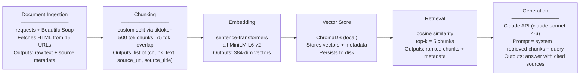

# Project 1 Planning: The Unofficial Guide

> Write this document before you write any pipeline code.
> Your spec and architecture diagram are what you'll use to direct AI tools (Claude, Copilot, etc.) to generate your implementation — the more specific they are, the more useful the generated code will be.
> Update the Retrieval Approach and Chunking Strategy sections if you change your approach during implementation.
> Update this file before starting any stretch features.

---

## Domain

<!-- What domain did you choose? Why is this knowledge valuable and hard to find through official channels? -->

I chose Yale residential college experiences and culture. I wanted to share what differentiates the 14 colleges in terms of social life, dining quality, room quality, community vibe, housing, etc. 

This knowledge is valuable because the residential college you're assigned to shapes your friend group, your dining hall, your room quality, your daily commute to class, and your social community for all four years. It's one of the most important variables of the Yale experience.

It's hard to find this information because Yale downplays differences between colleges. This is because assignment is random and they say all colleges are equally great. That's partly true, but everyone knows there are real differences. Some colleges have newer renovations, better dining hall staff, more active butteries, stronger intramural cultures, or more centrally located courtyards. Official sources won't tell you that Berkeley's dining hall ranked last two years running, or that 83 students tried to transfer out of their college in one year, or how the housing lottery actually disadvantages certain suite configurations. Students have to find out through student journalism, forums, and word of mouth, which is a perfect opportunity to create a guide. 

---

## Documents

<!-- List your specific sources: URLs, subreddit names, forum threads, or file descriptions.
     Aim for at least 10 sources that together cover different subtopics or perspectives within your domain. -->

| # | Source | Description | URL or location |
|---|--------|-------------|-----------------|
| 1 | Yale Herald Residential College Rankings | Student publication's ranked breakdown of all 14 colleges with commentary on vibe, location, and amenities | https://medium.com/the-yale-herald/yale-herald-best-residential-colleges-official-rankings-f4fe5c515a1e |
| 2 | Yale Daily News — "A Very Reliable Ranking" (2023) | YDN's own college-by-college ranking with student-written rationale for each placement | https://yaledailynews.com/blog/2023/08/31/a-very-reliable-ranking-of-the-residential-colleges/ |
| 3 | Yale Daily News — Best and Worst of Yale Dining (2025) | Data-driven ranking of all dining halls based on student surveys; names top and bottom colleges | https://yaledailynews.com/blog/2025/02/09/data-the-best-and-worst-of-yale-dining/ |
| 4 | Yale Daily News — Buttery Prices Rise (2024) | Covers the late-night buttery scene across colleges, which butteries are most popular, and cost changes | https://yaledailynews.com/blog/2024/10/08/prices-rise-at-some-residential-college-butteries/ |
| 5 | Yale Daily News — Housing Luck of the Draw | How the housing lottery works in practice, including which suite configurations are hardest to get | https://yaledailynews.com/articles/in-housing-the-luck-of-the-draw |
| 6 | Yale Daily News — 72 Residential College Transfer Requests (2025) | Data on how many students try to switch colleges, approval rates, and most common reasons | https://yaledailynews.com/blog/2025/02/09/deans-office-receives-72-residential-college-transfer-requests-approves-nearly-three-quarters/ |
| 7 | College Confidential — Best Residential Colleges Ranked | Forum thread with current and prospective student opinions on college strengths and weaknesses | https://talk.collegeconfidential.com/t/best-residential-colleges-ranked/2093609 |
| 8 | College Confidential — Which College Is the Best? | Older but long thread; covers culture, location, dining, and social reputation of each college | https://talk.collegeconfidential.com/t/objectively-speaking-which-residential-college-is-the-best/718108 |
| 9 | Quora — What Is the Best Residential College at Yale? | Crowdsourced answers from current and former students with first-person experience | https://www.quora.com/What-is-the-best-residential-college-at-Yale |
| 10 | Quora — What Is the Worst Residential College at Yale? | Candid criticism of specific colleges; surfaces complaints rarely captured in positive-framed sources | https://www.quora.com/What-is-the-worst-residential-college-at-Yale |
| 11 | Roomsurf — Yale Dorm Reviews | Student-submitted room-level reviews organized by residential college; covers room size, noise, and condition | https://www.roomsurf.com/dorm-reviews/yale |
| 12 | Forward Pathway — Yale's Late-Night Butteries | Deep-dive explainer on how butteries work, what they sell, and their role as social hubs | https://www.forwardpathway.us/yales-late-night-butteries-a-unique-student-run-culinary-and-social-hub-in-residential-colleges |
| 13 | Yale Admissions Blog — Residential Colleges Debunked | A current student dispelling common myths about college assignment and what the differences actually are | https://admissions.yale.edu/bulldogs-blogs/bernice/2022/03/31/residential-colleges-yale-debunked |
| 14 | Wikipedia — Residential Colleges of Yale University | Factual baseline on all 14 colleges: founding year, location, architecture, notable alumni, and head of college | https://en.wikipedia.org/wiki/Residential_colleges_of_Yale_University |
| 15 | Yale Housing — Room Draw FAQs | Official rules for the housing lottery; useful for understanding the process students are navigating and complaining about | https://housing.yale.edu/undergraduate-housing/frequently-asked-questions/room-draw-faqs |

---

## Chunking Strategy

<!-- How will you split documents into chunks?
     State your chunk size (in tokens or characters), overlap size, and explain why those
     numbers fit the structure of your documents.
     A review-heavy corpus warrants different chunking than a long FAQ. -->

**Chunk size:** 500 tokens

**Overlap:** 75 tokens

**Reasoning:** The corpus mixes short-form content with longer articles. A 500-token chunk is large enough to capture a complete thought from a news article or a full forum reply, but small enough that a single chunk doesn't blend opinions about two different colleges together. The 75-token overlap guards against splitting info across a boundary. 

---

## Retrieval Approach

<!-- Which embedding model are you using (e.g., all-MiniLM-L6-v2 via sentence-transformers)?
     How many chunks will you retrieve per query (top-k)?
     If you were deploying this for real users and cost wasn't a constraint, what tradeoffs
     would you weigh in choosing a different embedding model — context length, multilingual
     support, accuracy on domain-specific text, latency? -->

**Embedding model:** `all-MiniLM-L6-v2` via `sentence-transformers`

**Top-k:** 5

**Production tradeoff reflection:** `all-MiniLM-L6-v2` is fast and free, but it's a general-purpose model trained on broad web text, not Yale-specific language. In production, I'd weigh several tradeoffs. Accuracy on domain-specific text: a model like OpenAI's `text-embedding-3-large` performs better on nuanced semantic similarity (e.g., distinguishing "the dining hall is good" from "the dining hall used to be good before the renovation"), which matters here because many chunks express subtle qualified opinions. Context length: some Yale Daily News articles are long; a model with a 512-token limit (like MiniLM) truncates chunks that exceed it, losing content — `text-embedding-3-large` supports 8191 tokens, which would let me use larger chunks if I wanted. My conclusion is to use MiniLM' because its free

---

## Evaluation Plan

<!-- List your 5 test questions with their expected correct answers.
     Questions should be specific enough that you can judge whether the system's response
     is right or wrong. "What are good dining halls?" is too vague.
     "What do students say about wait times at [dining hall name] during lunch?" is testable. -->

| # | Question | Expected answer |
|---|----------|-----------------|
| 1 | Which Yale residential college dining hall ranked last in the 2025 Yale Daily News dining data study? | Pierson College ranked last. |
| 2 | What is a buttery, and which residential colleges are known for having the most popular ones? | A buttery is a late-night student-run snack bar in each residential college, open after dining halls close, serving comfort food like grilled cheese and fries. Specific colleges are noted as having particularly active butteries in the sources. |
| 3 | How are room selection appointment times assigned in the Yale housing lottery? | Each housing group is randomly assigned a room selection appointment time through the Yale College Housing portal after forming a group and declaring intent to live on campus. |
| 4 | How many students requested to transfer residential colleges in 2025, and approximately what fraction were approved? | 72 students requested transfers; nearly three-quarters (roughly 54) were approved. |
| 5 | What is the most common reason students give when requesting a residential college transfer? | The most common reason, cited in over 90% of applications, is wanting to live with friends who are in a different residential college. |

---

## Anticipated Challenges

<!-- What could go wrong? Name at least two specific risks with reasoning.
     Consider: noisy or inconsistent documents, missing source attribution, off-topic
     retrieval, chunks that split key information across boundaries. -->

1. **Contradictory opinions across sources.** Posts, Quora answers, and student rankings frequently disagree. One post calls Grace Hopper the best college while another calls it overrated. When a user asks "which college has the best social life," the retriever will pull chunks expressing opposing opinions, and the generator may either hedge uselessly ("some say X, others say Y") or arbitrarily favor one source. The system has no way to weight recency, author credibility, or sample size.

2. **Chunks that name a college without enough context to be useful.** Many forum posts say things like "I'm in JE and love it" without explaining what JE means or what specifically they love. If a chunk is retrieved for a query about Jonathan Edwards College, it may confirm that students like it without providing any actionable detail. This is a chunking and source quality problem because short, context-free posts produce low-information chunks that pass semantic similarity but fail to answer the question. 

---

## Architecture

<!-- Draw a diagram of your pipeline showing the five stages:
     Document Ingestion → Chunking → Embedding + Vector Store → Retrieval → Generation
     Label each stage with the tool or library you're using.
     You can use ASCII art, a Mermaid diagram, or embed a sketch as an image.
     You'll use this diagram as context when prompting AI tools to implement each stage. -->

---

## AI Tool Plan

<!-- For each part of the pipeline below, describe:
     - Which AI tool you plan to use (Claude, Copilot, ChatGPT, etc.)
     - What you'll give it as input (which sections of this planning.md, which requirements)
     - What you expect it to produce
     - How you'll verify the output matches your spec

     "I'll use AI to help me code" is not a plan.
     "I'll give Claude my Chunking Strategy section and ask it to implement chunk_text()
     with my specified chunk size and overlap" is a plan. -->

**Milestone 3 — Ingestion and chunking:**
I'll use Claude. Input: the Documents table (all 15 URLs and source types) plus the Chunking Strategy section. I'll ask Claude to implement two functions: `ingest_documents(urls: list[dict]) -> list[dict]` that fetches each URL with `requests` + `BeautifulSoup`, strips nav/footer boilerplate, and returns `{text, source_url, source_title}`; and `chunk_text(doc: dict, chunk_size=500, overlap=75) -> list[dict]` that uses `tiktoken` to split on token boundaries and attaches source metadata to each chunk. I'll verify by printing chunk count, average chunk length in tokens, and manually inspecting 3–4 chunks from different source types to confirm metadata is attached and no chunk exceeds 500 tokens.

**Milestone 4 — Embedding and retrieval:**
I'll use Claude. Input: the Retrieval Approach section plus the output schema from Milestone 3 (`list[dict]` with `chunk_text`, `source_url`, `source_title`). I'll ask Claude to implement `embed_and_store(chunks: list[dict]) -> None` using `sentence-transformers` (`all-MiniLM-L6-v2`) and ChromaDB to persist vectors and metadata locally, and `retrieve(query: str, k=5) -> list[dict]` that embeds the query and returns the top-k chunks with scores. I'll verify by running each of my 5 evaluation questions through `retrieve()` and checking that the returned chunks are semantically relevant and contain the source metadata needed to answer them.

**Milestone 5 — Generation and interface:**
I'll use Claude. Input: the full planning.md (domain, evaluation questions, architecture diagram) plus the output schema from `retrieve()`. I'll ask Claude to implement `generate_answer(query: str) -> str` that calls `retrieve()`, formats the top-5 chunks into a prompt with source citations, and calls the Claude API to produce an answer; and a simple CLI loop (`input()` → `generate_answer()` → `print()`) so I can run the evaluation plan manually. I'll verify by running all 5 evaluation questions from the Evaluation Plan section and checking each response against the expected answer, flagging any that are wrong or that fail to cite a source.